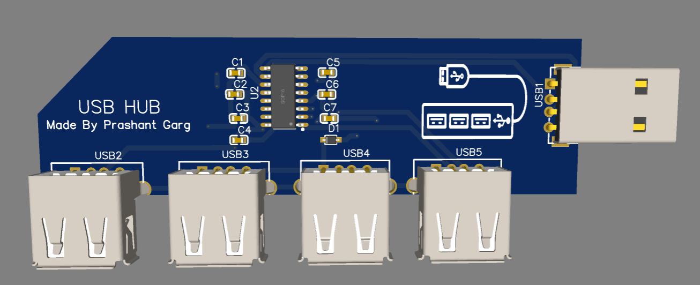

- Title: "USB HUB"
- Author: "Prashant Garg"
- Description: "A 4-port USB 2.0 hub built using the SL2.1A controller, designed in EasyEDA."
- Created On: "12/7/2025"
---

# July 12th: Finalized Idea and Components  
- Decided to create a USB Hub with 1 input and 2 output ports.
- Selected SL2.1A USB hub controller for USB 2.0 compatibility.
- Finalized components: USB connectors, capacitors, Schottky diode.
- Began initial schematic planning in EasyEDA.

**Total time spent: 2h**

---

# July 13th: Schematic Design  
- Completed the schematic in EasyEDA.
- Connected SL2.1A with 2 USB outputs and 1 USB input.
- Added bypass capacitors (10uF) to VCC lines.
- Added pull-up resistors and 22Ω inline resistors for USB data lines.
- Verified power, ground, and USB D+/D− connections.

**Total time spent: 3h**

---
# July 14th: Changed the mind and created for 4 USB slots 
- Completed the schematic in EasyEDA.
- Connected SL2.1A with 4 USB outputs and 1 USB input.
- Added bypass capacitors (10uF) to VCC lines.
- Added pull-up resistors and 22Ω inline resistors for USB data lines.
- Verified power, ground, and USB D+/D− connections.

**Total time spent: 3h**

---

# July 15th: PCB Layout & Silkscreen  
- Placed USB ports in a straight row for easy access.
- Routed all signal and power traces using EasyEDA auto-router + manual tuning.
- Added silkscreen text: “USB HUB - Made By Prashant Garg”.
- Generated 3D rendering of the final board.

**Total time spent: 2h**
