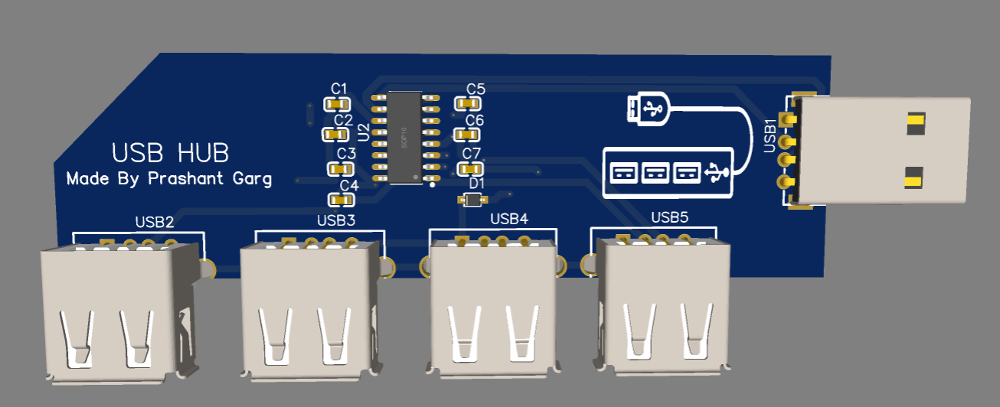

# USB-HUB

A simple 4-port USB 2.0 Hub designed using EasyEDA and custom PCB layout. This hub splits a single USB-A input into 4 USB-A output ports for connecting multiple peripherals.

---
## Features

- 1x USB-A male input (USB1)
- 4x USB-A female outputs (USB2 to USB5)
- On-board capacitors for stability
- Compact custom PCB design
- Designed in EasyEDA

---
## Files Included

- `Gerber` – Manufacturing files
- `BOM.csv` – Bill of Materials
- `journal.md` – Design and testing log
---

## 📦 Components (BOM)
| ID | Name                   | Designator                 | Footprint          | Quantity | Manufacturer Part  | Manufacturer |
| -- | ---------------------- | -------------------------- | ------------------ | -------- | ------------------ | ------------ |
| 1  | 10uF Capacitor         | C1, C2, C3, C4, C5, C6, C7 | C0603              | 7        | CL10A106KP8NNNC    | Samsung      |
| 2  | Schottky Diode         | D1                         | SOD-323\_L1.8-W1.3 | 1        | NSR0320MW2T1G      | Onsemi       |
| 3  | USB Hub IC             | U2                         | SOP-16\_L10.0-W3.9 | 1        | SL2.1A             | CoreChips    |
| 4  | USB-A Male Connector   | USB1                       | USB-A-TH\_U-G-04DD | 1        | U-G-04DD-W-1       | 韩电韩瑞         |
| 5  | USB-A Female Connector | USB2, USB3, USB4, USB5     | USB-A-TH\_C49474   | 4        | 903-131A1011D10100 | 精拓金电         |
---
## License

This project is licensed under the MIT License.

